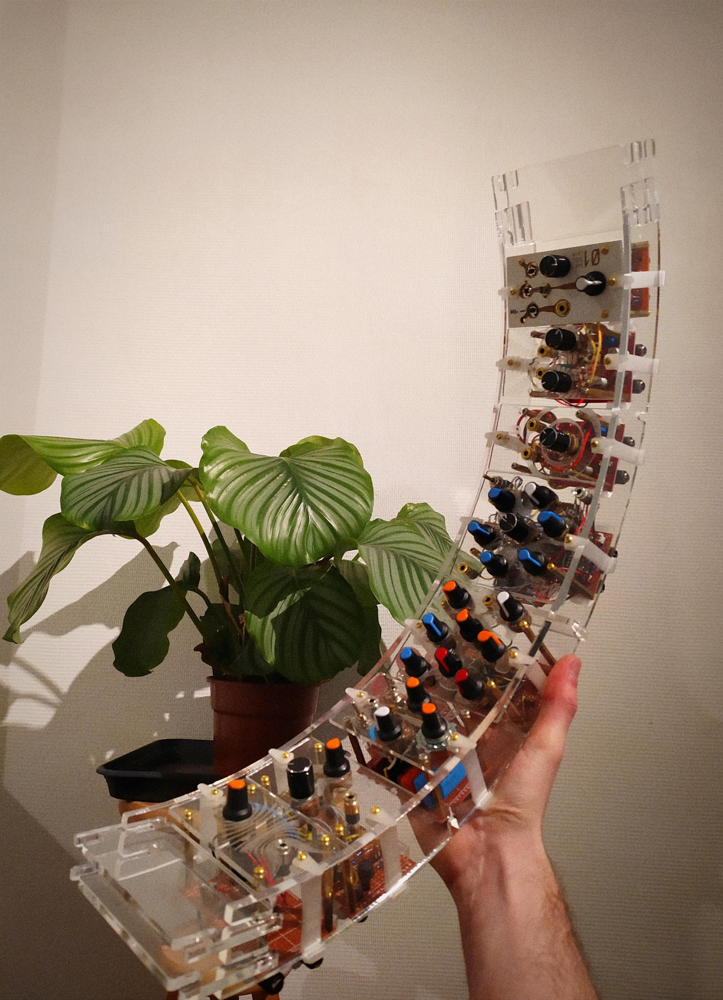
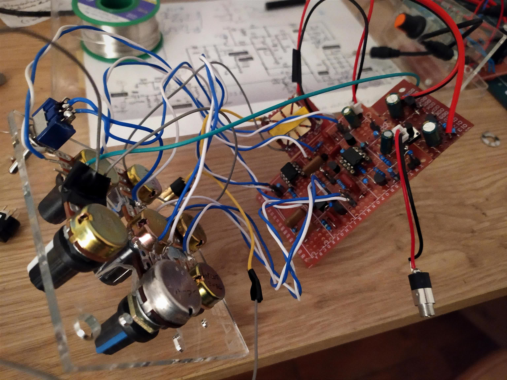
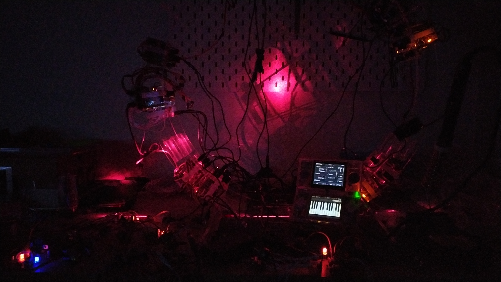
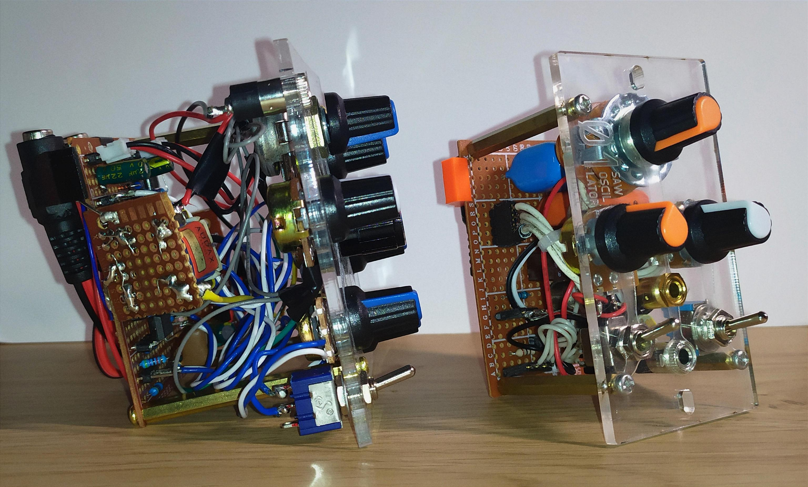
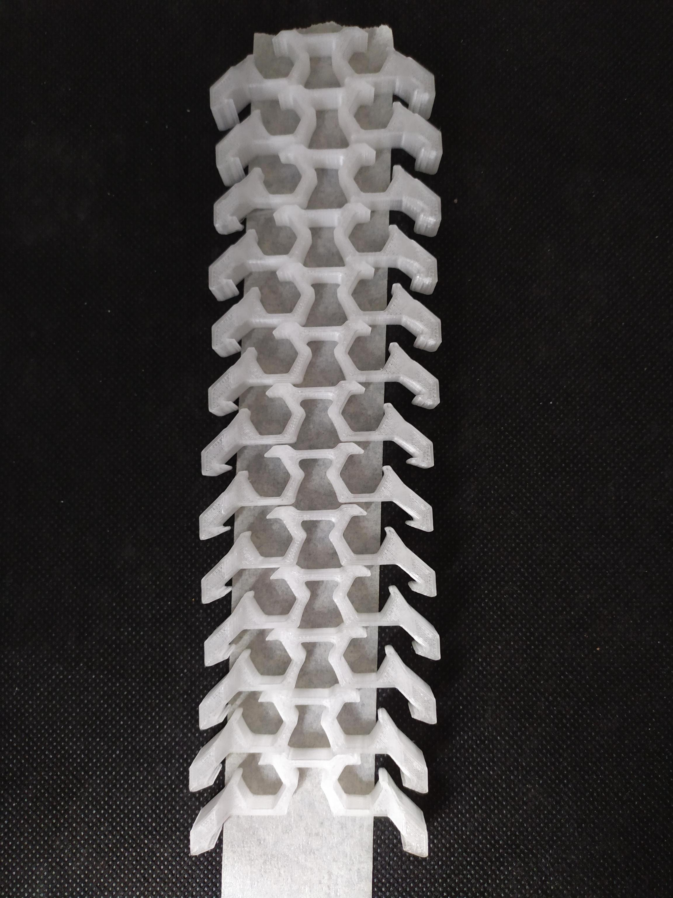
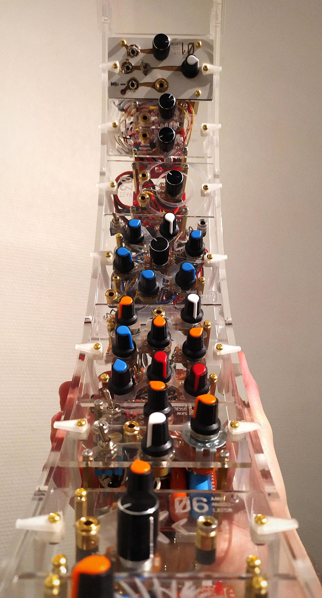

# ModularSynth
<!-- Official PDF [Documentation](DOCUMENTATION/Modular_Doc_v001.pdf) ! -->
---
> Files, ideas and processes used to create an open source modular synth (based on personal experimentations)

 

 

 

---
  ## Summary
I started this project in October 2023. Using amalgamations of internet obscur diagrams and dad's help, I'm gradually constructing this modular synthesizer. The project is currently focusing on two main aspects : the electronic/musical part, involving exploration of new modules and interesting schematics, and the mechanical part, including the design and fabrication of the ring in various materials.

  ### *Halo / Ring*
The device's shape follows that of a halo. Composed of two parallel rails, the halo serves as a rack to insert and slide modules side by side.

  ### *Modules*
Modules are composed of several parts : [Frontplate made out of plexiglas](production/frontplate_design/), brass columns for assembly, the electronic card with the schematics soldered by hand on it, cables and finally the power supplies.
As you may have noticed, a lot of the frontplate design is referencing the various concepts of the [Rain world](https://store.steampowered.com/app/312520/Rain_World/) univers.
Some other glyph and mysterious symboles refer to diverses fictions and universes from multiple pieces of art including [personal ones](https://theodelamare.xyz/pages/3dUCHRO.html).
This enigmatic and cryptic approach of the design around the object follow the same concept behind the circular shape of the synthetiser, it's all about opacity and fabulations projected onto the machine. How such weird metalic assembly produces outer space sound and floating feelings, how do some pot manipulation enhance thoses states of mind. I wanted this machine to carry all these metaphorical symbols.

  ### *Electronic*
A note on compatibility : This project is not really Eurorack compatible as I'm still experimenting with basic electronics but I'll try to adapt it in the future if needed.

The Halo is currently composed of several modules such as :
- Double CV LFO
-	Orgue Oscillators
- Reverb volumetric
- Kick drum
- Hacher
- ZombiBox
- Thérémine
- Sequencer
- DrumBox
- ...

---

 

 

 

---
  ## Ressources
+ [Production](production/)

    ### *from the internet*
+ [Moritz Klein Tutorial to build a kick drum module](https://www.youtube.com/watch?v=yz37Yz315eU)
+ [EricaSynths](https://www.ericasynths.lv/)
+ [Music from outer space](http://musicfromouterspace.com/analogsynth_new/NOISETOASTER/NOISETOASTER.php)
+ [Simulation website](https://www.falstad.com/circuit/)
