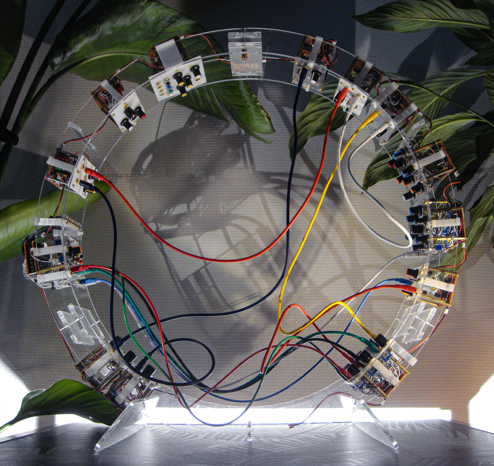
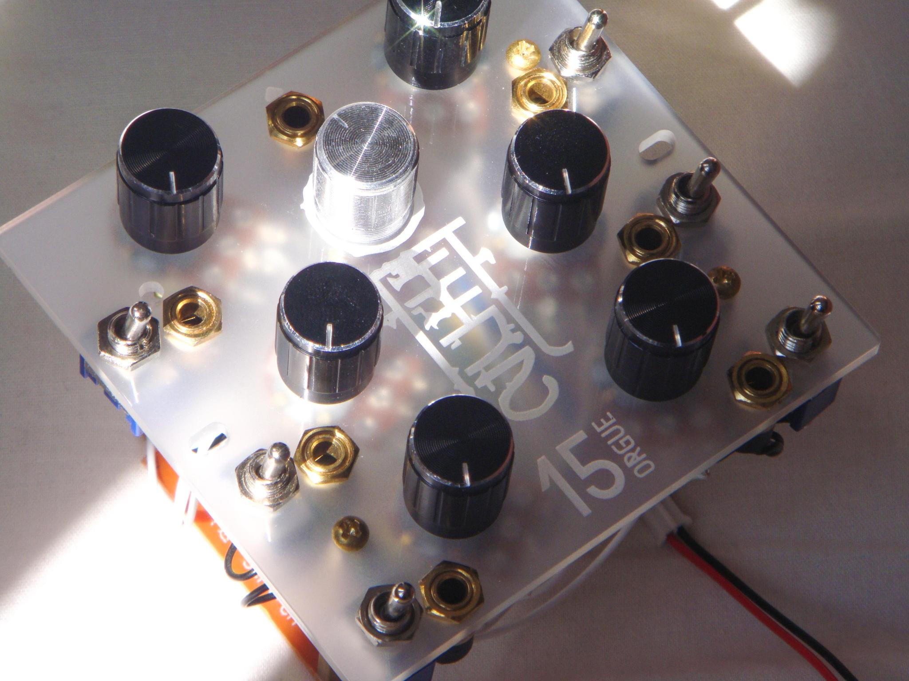
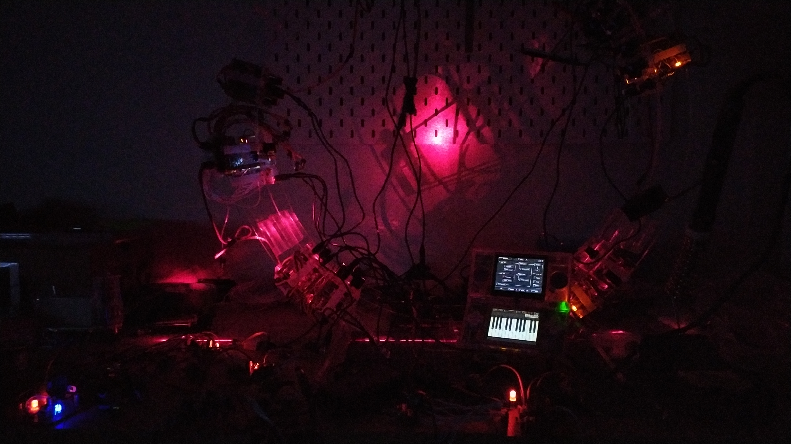
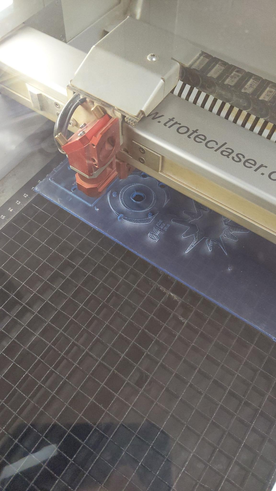
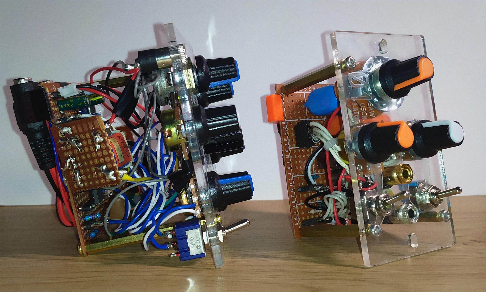
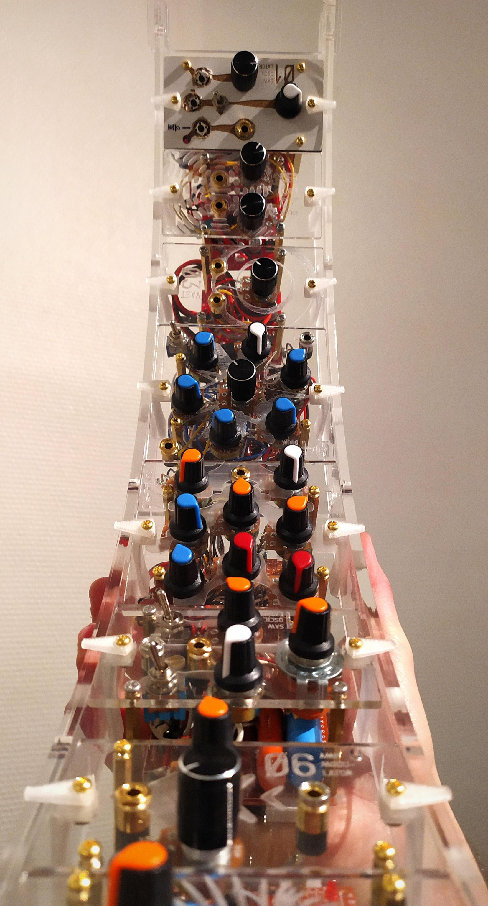
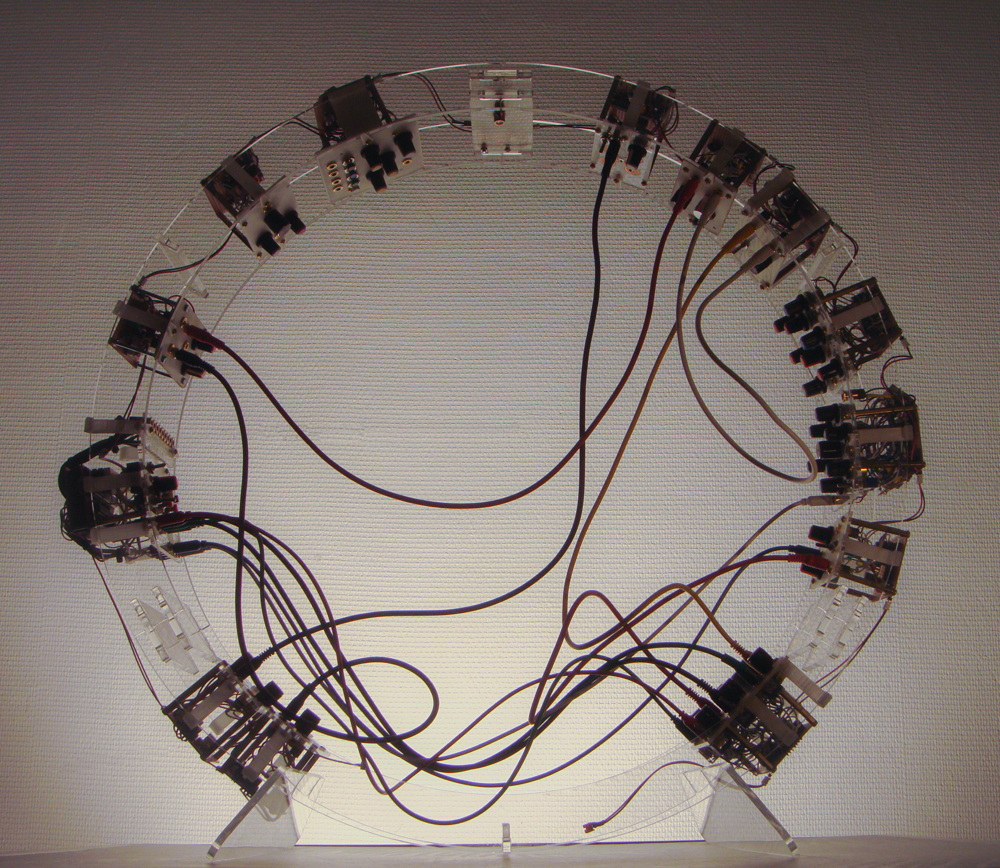

# RingModularSynth
Official PDF [Documentation](doc/Modular_Doc_V01.pdf) !
---
> Files, ideas and processes used to create an open source modular synth (based on personal experimentations)

 

 

---
  ## Summary
  ### *The concept*
Immersed in an atmosphere hovering between science fiction and ancient relic, the Ring Modular Synthesizer produces sounds and textures that are truly unique.

When designing the interface for this machine, my goal was to make sound creation feel more instinctive and spontaneous, rather than bound by technical or functionalist constraints. That’s why most of the knobs and switches follow cryptic codes, closer to intuition and sensation than to conventional labeling. This choice also gives the instrument a mysterious character, placing it within an extravagant narrative world, deliberately at odds with the technical sobriety usually associated with electronic music.

As a musician, artist, and tinkerer, I build this synthesizer and its modules together with Vincent Delamare, who brings the technical expertise essential to the project.
I started this project in October 2023. Using amalgamations of internet obscur diagrams. The project is currently focusing on two main aspects : the electronic / musical part, involving exploration of new modules and interesting schematics, and the artistic / mechanical part, including the design and fabrication of the ring in various materials.

  ### *Halo / Ring*
The device's shape follows that of a halo. Composed of two parallel rails, the ring serves as a rack to insert and slide modules side by side.

  ### *Modules*
Modules are composed of several parts : [Frontplate made out of plexiglas](production/frontplate_design/), brass columns for assembly, the electronic card with the schematics soldered by hand on it, cables and finally the power supplies.
As you may have noticed, a lot of the frontplate design is referencing the various concepts of the [Rain world](https://store.steampowered.com/app/312520/Rain_World/) univers.
Some other glyph and mysterious symboles refer to diverses fictions and universes from multiple pieces of art including [personal ones](https://theodelamare.xyz/pages/3dUCHRO.html).
This enigmatic and cryptic approach of the design around the object follow the same concept behind the circular shape of the synthetiser, it's all about opacity and fabulations projected onto the machine. How such weird metalic assembly produces outer space sound and floating feelings. I wanted this machine to carry all these metaphorical symbols.

  ### *Electronic*
A note on compatibility : This project is not Eurorack compatible as I'm still experimenting with basic electronics, but I might adapt it in the future if needed.

The Halo is currently composed of several modules such as :
- Double CV LFO
-	Orgue Oscillators
- Reverb volumetric
- Kick drum
- Hacher
- ZombiBox
- Thérémine
- Sequencer
- DrumBox
- ...

---

 

 

 

---
  ## Ressources
+ [Production](production/)

    ### *from the internet*
+ [Moritz Klein Tutorial to build a kick drum module](https://www.youtube.com/watch?v=yz37Yz315eU)
+ [EricaSynths](https://www.ericasynths.lv/)
+ [Music from outer space](http://musicfromouterspace.com/analogsynth_new/NOISETOASTER/NOISETOASTER.php)
+ [Simulation website](https://www.falstad.com/circuit/)

---

### Contact
+ Mail : theo.delamare@protonmail.com
+ [Insta](https://www.instagram.com/theo_delamare_/)
+ [Bandcamp](https://theodelamare.bandcamp.com/)

---
 

