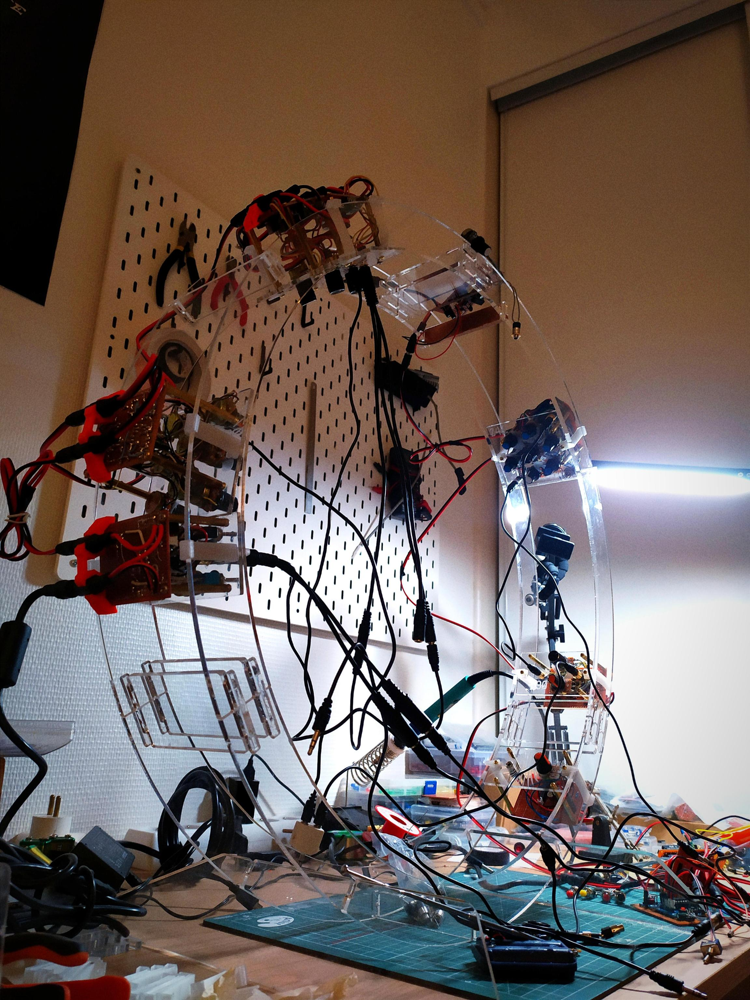

# ModularSynth
> Files, ideas and processes used to create a fully open source modular synth (based on personal experimentations)

 

 

 
https://github.com/TheoDelamare/ModularSynth/assets/92792157/5a63ab01-0ff9-4eb3-9692-c3d30dfbd2d2
 

---
  ## Summary
I started this project in October 2023. Using amalgamations of diagrams found on the internet and assistance from external individuals, I'm gradually constructing this modular synthesizer. The project is currently progressing on two main aspects at the same time : the electronic/musical part, involving the exploration of new modules and interesting schematics, and the mechanical part, including the design and fabrication of pieces in various materials.

  ### *Halo*
The device's shape follows that of a halo. Composed of two parallel rails, the halo serves as a rack to insert and slide modules side by side.
  - Modules are composed of several parts : [Frontplate made out of plexiglas](production/frontplate_design/), brass columns for assembly, the electronic card with the [schematics](schematics/) soldered by hand on it, cables and finally the power supplies held at the back by a [custom 3d printed piece](production/3d_printing/).

  ### *Electronic*
A note on compatibility : for instance the project is not really Eurorack compatible as I'm still experimenting with basic electronics but I'll try to adapt it in the future.

The Halo is currently composed of several modules such as :
- pulse generator
-	oscillator
- Snow white noise
- reverb
- reverb volumetric
- kick drum
- microphone
- amp modulator
- ZombiBox
- Radio
- Thérémine
- Sequencer
- Sampler
- DrumBox
- ...

---

 

 

 

 

 

---
  ## Ressources
+ [Schematics](schematics/)
+ [Production](production/)

    ### *from the internet*
+ [Moritz Klein Tutorial to build a kick drum module](https://www.youtube.com/watch?v=yz37Yz315eU)
+ [EricaSynths](https://www.ericasynths.lv/)
+ [Music from outer space](http://musicfromouterspace.com/analogsynth_new/NOISETOASTER/NOISETOASTER.php)
+ [Simulation website](https://www.falstad.com/circuit/)
